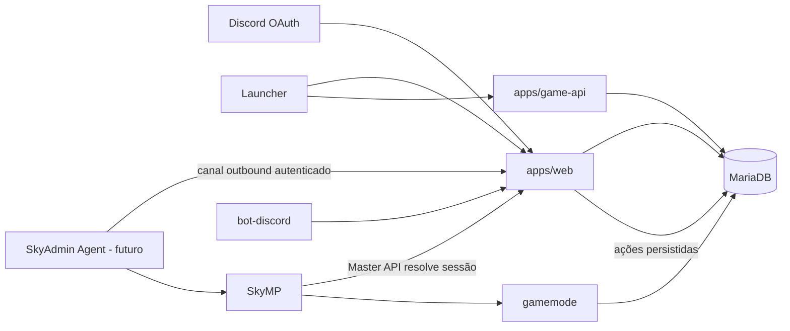

# Arquitetura alvo



## Identidade canônica

| Identificador | Dono | Uso |
|---|---|---|
| `discord_id` | Discord | identidade externa de login e bot |
| `account_id` | MariaDB `accounts.id` | identidade interna permanente |
| `profileId` online | Master API/SkyMP | é o `account_id` resolvido pela sessão |
| `character_id` | MariaDB `characters.id` | personagem aprovado |
| `actorId` | runtime SkyMP | entidade conectada, temporária |

Fluxo obrigatório: Discord autentica a conta; o launcher recebe um ticket opaco; `game-api` cria `game_sessions`; o Master API devolve `game_sessions.account_id`; SkyMP usa esse valor como `profileId`; o gamemode carrega o personagem daquela conta.

## Componentes administrativos

### Painel web

Responsável por autenticação, leitura, autorização, validação de payload, criação de ação, auditoria e UI. Não fala diretamente com `mp`, shell ou arquivos arbitrários.

### MariaDB

Armazena as entidades e a fila. Mudança de estado de domínio e criação de evento/outbox ocorrem na mesma transação.

### Agent futuro

Processo local do host SkyMP, conectado de saída ao painel. Recebe somente comandos de catálogo permitidos, confirma execução e reporta heartbeat, logs e métricas. Não deve aceitar comandos livres.

## Contrato da ação administrativa

```json
{
  "actionId": "uuid",
  "requestId": "uuid",
  "idempotencyKey": "string estável por tentativa do usuário",
  "type": "moderation.kick",
  "actorAccountId": 12,
  "targetAccountId": 42,
  "reason": "texto obrigatório",
  "payload": {},
  "status": "pending"
}
```

Estados: `pending`, `dispatched`, `acknowledged`, `succeeded`, `failed`, `cancelled`, `expired`. A transição é sempre registrada; `succeeded` não pode voltar a `pending`.
