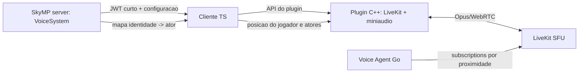

# Auditoria do fork de voz Metadraconis/skymp-vgr

**Data:** 2026-08-11  
**Conclusao:** e o unico fork analisado com uma implementacao ponta a ponta de
voz no codigo-fonte. Nao e evidencia suficiente para chama-lo de pronto para
producao: nao executamos seu cliente recompilado nem sua infraestrutura, e ha
lacunas objetivas abaixo.

## Como o fork implementa voz

1. `voiceSystem.ts` espera o ator existir, cria uma identidade com nonce e
   emite um JWT LiveKit de cinco minutos, limitado a uma sala e sem direitos de
   administracao.
2. `voiceChatService.ts` recebe a configuracao pelo `customPacket`, chama o
   plugin nativo, opera PTT e pede novo token se a conexao de voz cair.
3. `VoiceChat.cpp` usa miniaudio para captura/playback e o SDK C++ LiveKit para
   publicar/receber audio Opus. Tambem aplica ganho, noise gate, AGC, distancia
   e pan stereo dentro do cliente.
4. O agente Go contem a logica de limitar cada ouvinte aos falantes mais
   proximos e usa a API de subscriptions do LiveKit. O Terraform sobe LiveKit,
   Redis e esse agente como servicos separados.

## Evidencias no repositorio

| Componente | Arquivo no fork | Estado observado |
| --- | --- | --- |
| Token e ciclo de sessao | `skymp5-server/ts/systems/voiceSystem.ts` | Implementado; TTL curto, identidade por sessao e cooldown de reconexao |
| Cliente do jogo | `skymp5-client/src/services/services/voiceChatService.ts` | Implementado; PTT, posicao e reconexao |
| Captura/audio nativo | `skymp5-server/cpp/client/VoiceChat.cpp` | Implementado sob `SKYMP_VOICE_CHAT_ENABLED` |
| SFU e deploy | `infra/voice/main.tf` | Estrutura de ECS/Redis/LiveKit presente |
| Filtro de streams | `voice-agent/main.go` | Logica presente, mas com lacuna de inicializacao |

## Ressalvas encontradas no proprio codigo

Estas observacoes impedem afirmar que o fork funciona em producao apenas pela
arvore de arquivos:

- `VoiceAgent.Start` sobe a API HTTP, mas nao inicia `proximityLoop`. Assim, a
  rotina que assina/desassina tracks por distancia nao roda como esta no arquivo.
- A API do agente em `:8090/api/position` aceita origem `*` e nao exige
  autenticacao. Ela deve ficar privada e autenticada antes de qualquer deploy.
- Na arvore revisada nao ha um chamador do servidor de jogo para
  `/api/position`; portanto o agente pode permanecer sem posicoes. O cliente
  ainda calcula espacializacao local, logo voz basica pode tocar, mas a economia
  de banda por subscriptions nao fica comprovada.
- Nao ha teste de integracao que conecte dois clientes Skyrim compilados ao
  LiveKit. A documentacao do fork declara suporte; isso nao substitui evidencia
  reproduzivel de audio real.

## Comparacao com o Heavy RP

O Heavy RP ja tem relay proprio: helper nativo captura o microfone, o servidor
autentica por ticket e entrega frames somente a listeners proximos. O ganho do
fork e trocar PCM/Base64 em WebSocket por Opus/WebRTC e um SFU, que escala melhor
quando ha muitos ouvintes. O preco e reconstruir e manter o cliente nativo,
LiveKit/TURN, UDP, segredos e observabilidade.

Nao devemos copiar o codigo: o fork declara `NOASSERTION` como licenca. A
arquitetura pode orientar um design proprio; qualquer reutilizacao exige
confirmacao de licenca e autoria.

## Recomendacao

1. Manter e testar o relay atual para o primeiro grupo fechado.
2. Registrar bytes/s, CPU, perda e latencia com 5, 10 e 20 ouvintes.
3. Abrir migracao LiveKit apenas se esses dados mostrarem limite real.
4. Se a migracao for aprovada, implementar primeiro um prototipo isolado com
   dois clientes e token curto; depois adicionar SFU/TURN e filtro de streams.
5. Nunca expor a API de posicao do agente na internet sem autenticacao e sem
   origem privada definida.

## Fontes primarias

- [Repositorio do fork](https://github.com/Metadraconis/skymp-vgr)
- [Servidor de tokens](https://github.com/Metadraconis/skymp-vgr/blob/main/skymp5-server/ts/systems/voiceSystem.ts)
- [Cliente de voz](https://github.com/Metadraconis/skymp-vgr/blob/main/skymp5-client/src/services/services/voiceChatService.ts)
- [Plugin C++](https://github.com/Metadraconis/skymp-vgr/blob/main/skymp5-server/cpp/client/VoiceChat.cpp)
- [Agente de proximidade](https://github.com/Metadraconis/skymp-vgr/blob/main/voice-agent/main.go)
